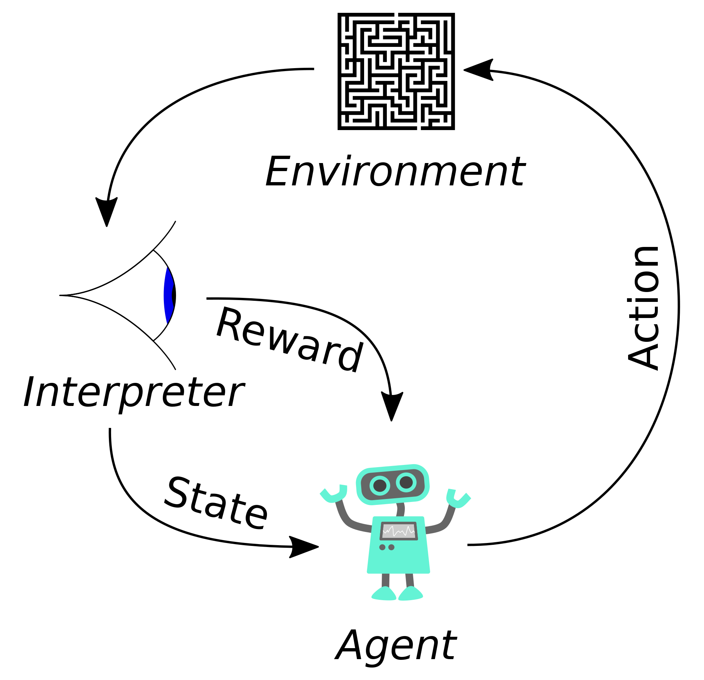
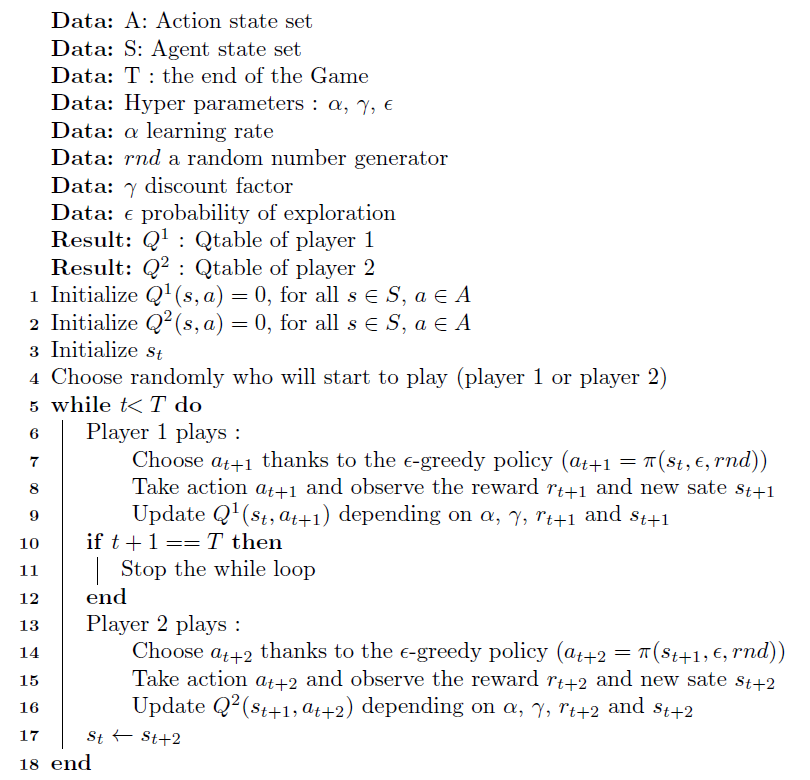

# Connect_X_with_Q_learning
Exploring the use of RL algorithms, specifically Q-learning to build an AI agent for the Connect Four board game.

### Intro

Due to developments in AI and machine learning, playing board games against AI opponents has grown in popularity in recent years. A more realistic and interesting experience can be had by using AI-powered game engines, which can present players with powerful opponents that can adjust to various play styles. AI agents may also go through a massive amount of game data to find patterns and methods that humans might not have noticed. Both humans and AI agents may benefit from better gaming as a result of this. Nowadays it’s possible to explore strategy and tactics in a competitive setting thanks to the emergence of AI-powered board game opponents, and it will be interesting to see how this trend develops in the future.

One of the most popular two-player strategy games for decades is Connect Four [1]. The goal of the game, which is played on a 6x7 board, is to line up four of your own colored discs in a row in any direction before your opponent does the same. The game is a favorite of both competitive and casual players since it is easy to learn but offers a great lot of depth in terms of strategy.

A Connect Four learning AI bot can be developed using reinforcement learning (RL). A combination of supervised and unsupervised learning can be used to train the agent to predict game states depending on the state of the board and the player’s move. The agent can also gain knowledge by self-play, in which it competes with a replica of itself to develop a better strategy over time. To increase its chances of winning the game, the agent can use RL to improve its decision-making process and learn from experience.

### Background
#### Reinforcement Learning
Reinforcement learning (RL) is a type of machine learning that teaches an agent how to operate in a given environment in a way that will maximize a reward signal. The agent picks up new skills by trial and error, experimenting with various behaviors and analyzing the results, then modifying its behavior over time to maximize the reward 

As you can see in figure2 an agent takes actions in an environment, which is interpreted into a reward and a representation of the state, which are fed back into the agent. The environment is typically formulated as a Markov decision process (MDP)

#### Markov decision process
A mathematical framework called a Markov decision process (MDP) is used in reinforcement learning to describe decision-making issues. A set of potential states, a set of potential actions, and the rewards connected to executing those actions in each state are all described by MDPs. The main principle of an MDP is that state transition probabilities and rewards are entirely set by the state and action that is being taken at any one time, rather than by the history of prior states and acts. This is known as the Markov property.

A Markov decision process is a 4-tuple  $(S,A,P,R)$ , where as shown the figure 3, $S$ is a set of agent states, A is a set of actions the agent can take. $P = \text{Pr}(s_{t+1} = s' \mid s_t = s, a_t = a)$ is the probability of transition from state  $s$  to state  $s'$  under action $a \cdot P: A \times S \rightarrow \mathbb{R}^S$. Also, $R(s, s', a)$ is the immediate reward after transition from  $s$  to  $s'$  with action $a \cdot R: S \times S \times A \rightarrow \mathbb{R}$

The goal of Markov decision processes is to find a policy for the decision maker by maximizing the sum of the rewards over all time steps

$
$

In this article, we discuss two approaches to create a reinforcement learning agent to play and win the game.

#### Q-Learning

The fundamental concept of Q-Learning is to map out the full observation space and then record the agent's behaviors inside that map. The agent will then incrementally adjust its prior action based on whether it received a good or negative reward each time it comes across the same observation. A Q-Table is a type of data structure that stores the prior actions for each observation in the observation space. The Q-Learning equation shown below is most frequently used to perform this incremental updating of the Q-Table:

$
$

where  $r_t$  is the reward received when moving from the state  $s_t$  to the state  $s_{t+1}$ , and  $\alpha$  is the learning rate  $0<\alpha<1$. The discount factor $\gamma$ determines the importance of future rewards.

The trade-off between exploration and exploitation is one difficulty that reinforcement learning faces that other types of learning do not. A reinforcement learning agent must favor activities that it has previously done and proven to be effective in creating reward if it wants to reap a large amount of reward. However, it must try actions that it has never chosen before in order to find such actions. The agent must take advantage of its past experiences in order to profit, but it must also investigate in order to choose better future courses of action.\cite{trade_off-RL1}
To explore the state space of action $a_t$ in the learning process we define a Epsilon-greedy policy such that:

$
$

The most important concept is to teach two players at once. Another important distinction is that the award is contingent upon the success or failure of the opposing player. Player One's action should be rewarded if it resulted in the elimination of Player Two.
To do so we follow the procedure in Algorithm1:

